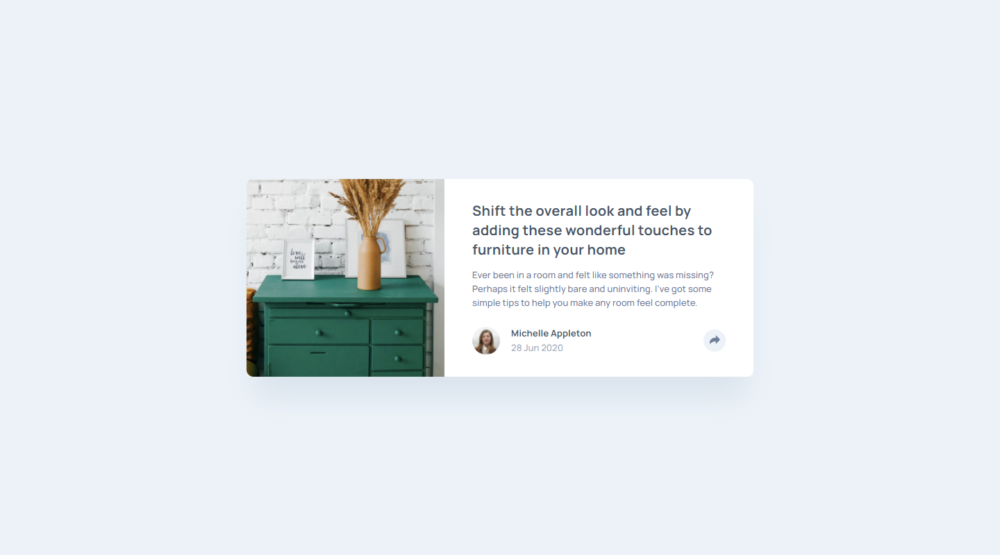
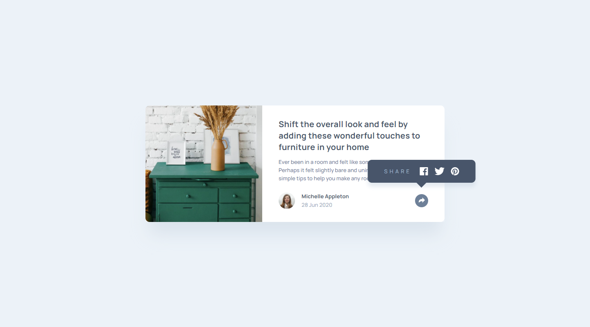
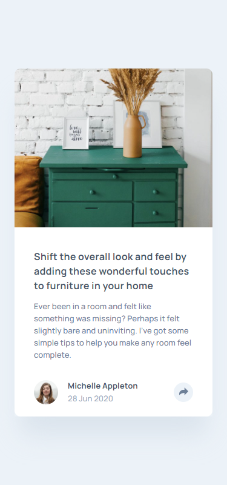
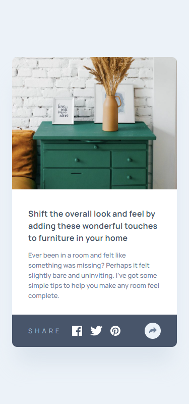

# Frontend Mentor - Article preview component

This is a solution to the [# Frontend Mentor - Article preview component challenge on Frontend Mentor](https://www.frontendmentor.io/challenges/article-preview-component-dYBN_pYFT). Frontend Mentor challenges help you improve your coding skills by building realistic projects.

## Table of contents

- [Overview](#overview)
  - [The challenge](#the-challenge)
  - [Screenshot](#screenshot)
  - [Links](#links)
- [My process](#my-process)
  - [Built with](#built-with)
  - [What I learned](#what-i-learned)
- [Author](#author)

## Overview

### The challenge

Users should be able to:

- View the optimal layout for the component depending on their device's screen size
- See the social media share links when they click the share icon

### Screenshot

### Links

- Solution URL: (https://www.frontendmentor.io/solutions/interactive-article-preview-card-with-tooltip-FB88lPu5p)
- Live Site URL: (https://lm-article-preview-component.netlify.app/)

## My process

### Built with

- Semantic HTML5 markup
- CSS custom properties/vars
- Desktop-first workflow

### What I learned

I learned how to make a tooltip. The Javascript was pretty easy however the styling tripped me up a little bit, as I had to duplicate the tooltip so one was relative to the button, and one relative to the overall card. A slight bit had me confused as I had to make sure the tooltip on mobile didnt open up the desktop too, and vice versa, since they both shared the same styling.

In the end I had to use !important on the .tooltip-hidden utility class, which I tried to avoid as much as possible, but couldn't in the end.

## Author

- Website - [Leon Michalak](https://www.leonmichalak.tech)
- Frontend Mentor - [@NinjaInShade](https://www.frontendmentor.io/profile/NinjaInShade)
- Instagram - [@lmdeveloper](https://www.instagram.com/lmdeveloper/)
